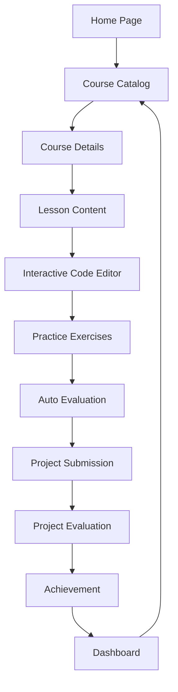

## 1. Product Overview
基于Python的数据分析在线教育平台，为商务数据分析与应用专业学生提供从基础到进阶的课程体系。
- 专注于商业场景应用，弱化底层算法开发，帮助学生掌握实际业务中需要的数据分析技能。
- 目标是成为商务数据分析专业学生的首选在线学习平台，提供互动式学习体验。

## 2. Core Features

### 2.1 User Roles
| Role | Registration Method | Core Permissions |
|------|---------------------|------------------|
| Student | Email/Google OAuth | Access courses, complete exercises, submit projects, track progress |
| Instructor | Invitation only | Create courses, manage content, review projects |

### 2.2 Feature Module
1. **Home page**: Hero section, course categories, featured courses, user progress
2. **Course page**: Course details, lesson list, learning content, interactive code editor
3. **Practice page**: Code exercises, auto-evaluation, feedback
4. **Project page**: Project requirements, submission, evaluation
5. **Dashboard page**: Progress tracking, achievements, recommendations

### 2.3 Page Details
| Page Name | Module Name | Feature description |
|-----------|-------------|---------------------|
| Home page | Hero section | Welcome message, platform overview, call-to-action buttons |
| Home page | Course categories | L1-L4 level-based course categories with brief descriptions |
| Home page | Featured courses | Highlighted courses with ratings and enroll button |
| Home page | User progress | Quick view of current learning status and next steps |
| Course page | Course details | Course description, prerequisites, learning outcomes |
| Course page | Lesson list | Structured list of lessons with completion status |
| Course page | Learning content | Text, images, videos explaining concepts |
| Course page | Interactive code editor | Three-column layout: business scenario, code editor, output/visualization |
| Practice page | Code exercises | Fill-in-the-blank code exercises with hints |
| Practice page | Auto-evaluation | Immediate feedback on code correctness |
| Practice page | Feedback | Detailed error messages and suggestions |
| Project page | Project requirements | Business scenario, data sources, expected deliverables |
| Project page | Submission | Code upload and description |
| Project page | Evaluation | Automated evaluation with predefined test cases |
| Dashboard page | Progress tracking | Visual representation of course completion and skill mastery |
| Dashboard page | Achievements | Badges and certificates earned |
| Dashboard page | Recommendations | Personalized course suggestions based on progress |

## 3. Core Process
### User Flow
1. **New User**: Lands on home page → browses courses → enrolls in L1 course → starts learning → completes lessons and exercises → earns certificate
2. **Returning User**: Logs in → views dashboard → continues current course → completes exercises → moves to next level
3. **Project Submission**: Reaches project module → reads requirements → writes code → submits → receives evaluation → earns badge

### Mermaid Flowchart

## 4. User Interface Design
### 4.1 Design Style
- Primary color: #3b82f6 (blue)
- Secondary color: #10b981 (green)
- Accent color: #f59e0b (amber)
- Button style: Rounded corners, subtle shadow, hover effects
- Font: Inter (body), Poppins (headings)
- Font sizes: 16px (body), 20px (subheadings), 28px (headings)
- Layout style: Card-based, clean, ample white space
- Icon style: Lucide icons, consistent line weight

### 4.2 Page Design Overview
| Page Name | Module Name | UI Elements |
|-----------|-------------|-------------|
| Home page | Hero section | Large banner with platform name, brief description, and CTA buttons. Blue gradient background with data visualization elements. |
| Home page | Course categories | Card grid with level indicators (L1-L4), each card has category name, icon, and course count. Hover effects with subtle animation. |
| Course page | Interactive code editor | Three-column layout: left column (business scenario) with light gray background, middle column (code editor) with dark theme, right column (output) with white background. Resizable columns. |
| Practice page | Code exercises | Fill-in-the-blank code blocks with hint buttons. Submit button with loading animation. Feedback section with color-coded messages (green for success, red for error). |
| Dashboard page | Progress tracking | Circular progress indicators for each level, bar charts for course completion, and line charts for learning activity over time. |

### 4.3 Responsiveness
- Desktop-first design
- Mobile adaptation: Single column layout, collapsible navigation, touch-friendly buttons
- Tablet optimization: Two-column layout where appropriate
- Breakpoints: 1200px (desktop), 768px (tablet), 480px (mobile)

### 4.4 3D Scene Guidance
Not applicable for this project.