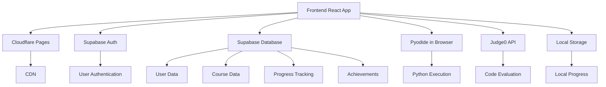
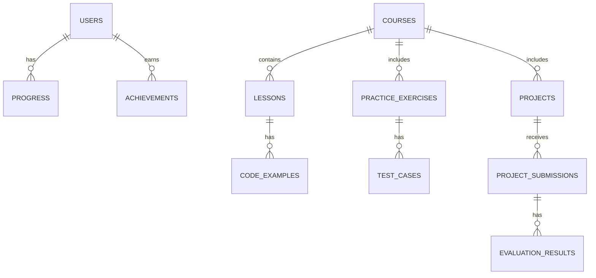

## 1. Architecture Design


## 2. Technology Description
- Frontend: React@18 + TypeScript + Tailwind CSS@3 + Vite
- Initialization Tool: vite-init
- Backend: None (pure static deployment on Cloudflare Pages)
- Database: Supabase (PostgreSQL) - free tier
- Authentication: Supabase Auth (email/Google OAuth)
- Python Execution: Pyodide (browser-based Python runtime)
- Code Evaluation: Judge0 API (free tier)
- State Management: Zustand
- Routing: React Router DOM
- UI Components: Custom components + Lucide icons
- Data Visualization: Chart.js

## 3. Route Definitions
| Route | Purpose |
|-------|---------|
| / | Home page with course categories and featured courses |
| /dashboard | User dashboard with progress and achievements |
| /courses | Course catalog |
| /courses/:id | Course details and lessons |
| /courses/:id/lessons/:lessonId | Lesson content with interactive code editor |
| /practice | Practice exercises |
| /projects | Project submissions and evaluations |
| /projects/:id | Project details and submission form |
| /auth/login | Login page |
| /auth/register | Registration page |
| /achievements | User achievements and certificates |

## 4. API Definitions
### Supabase API
- **Authentication**: `supabase.auth.signUp()`, `supabase.auth.signIn()`, `supabase.auth.signOut()`
- **User Data**: `supabase.from('users').select()`, `supabase.from('users').update()`
- **Course Data**: `supabase.from('courses').select()`, `supabase.from('lessons').select()`
- **Progress Tracking**: `supabase.from('progress').insert()`, `supabase.from('progress').update()`
- **Achievements**: `supabase.from('achievements').insert()`, `supabase.from('achievements').select()`

### Judge0 API
- **Code Execution**: `POST /submissions` with code, language, and test cases
- **Submission Status**: `GET /submissions/:id` to check execution status and results

## 5. Server Architecture Diagram
Not applicable for this project (pure static frontend).

## 6. Data Model
### 6.1 Data Model Definition


### 6.2 Data Definition Language
```sql
-- Users table
CREATE TABLE users (
  id UUID PRIMARY KEY,
  email VARCHAR(255) UNIQUE NOT NULL,
  name VARCHAR(255),
  avatar_url TEXT,
  created_at TIMESTAMP DEFAULT NOW(),
  last_login TIMESTAMP
);

-- Courses table
CREATE TABLE courses (
  id SERIAL PRIMARY KEY,
  title VARCHAR(255) NOT NULL,
  description TEXT,
  level VARCHAR(10) NOT NULL, -- L1, L2, L3, L4
  image_url TEXT,
  created_at TIMESTAMP DEFAULT NOW()
);

-- Lessons table
CREATE TABLE lessons (
  id SERIAL PRIMARY KEY,
  course_id INTEGER REFERENCES courses(id),
  title VARCHAR(255) NOT NULL,
  content TEXT,
  order_index INTEGER NOT NULL,
  created_at TIMESTAMP DEFAULT NOW()
);

-- Code examples table
CREATE TABLE code_examples (
  id SERIAL PRIMARY KEY,
  lesson_id INTEGER REFERENCES lessons(id),
  title VARCHAR(255),
  code TEXT NOT NULL,
  explanation TEXT
);

-- Practice exercises table
CREATE TABLE practice_exercises (
  id SERIAL PRIMARY KEY,
  course_id INTEGER REFERENCES courses(id),
  title VARCHAR(255) NOT NULL,
  description TEXT,
  template_code TEXT,
  difficulty VARCHAR(20),
  created_at TIMESTAMP DEFAULT NOW()
);

-- Test cases table
CREATE TABLE test_cases (
  id SERIAL PRIMARY KEY,
  exercise_id INTEGER REFERENCES practice_exercises(id),
  input TEXT,
  expected_output TEXT,
  is_hidden BOOLEAN DEFAULT FALSE
);

-- Projects table
CREATE TABLE projects (
  id SERIAL PRIMARY KEY,
  course_id INTEGER REFERENCES courses(id),
  title VARCHAR(255) NOT NULL,
  description TEXT,
  requirements TEXT,
  difficulty VARCHAR(20),
  created_at TIMESTAMP DEFAULT NOW()
);

-- Progress table
CREATE TABLE progress (
  id SERIAL PRIMARY KEY,
  user_id UUID REFERENCES users(id),
  course_id INTEGER REFERENCES courses(id),
  lesson_id INTEGER REFERENCES lessons(id),
  completed BOOLEAN DEFAULT FALSE,
  completion_date TIMESTAMP,
  last_accessed TIMESTAMP DEFAULT NOW()
);

-- Achievements table
CREATE TABLE achievements (
  id SERIAL PRIMARY KEY,
  name VARCHAR(255) NOT NULL,
  description TEXT,
  icon_url TEXT
);

-- User achievements table
CREATE TABLE user_achievements (
  id SERIAL PRIMARY KEY,
  user_id UUID REFERENCES users(id),
  achievement_id INTEGER REFERENCES achievements(id),
  earned_at TIMESTAMP DEFAULT NOW()
);

-- Project submissions table
CREATE TABLE project_submissions (
  id SERIAL PRIMARY KEY,
  user_id UUID REFERENCES users(id),
  project_id INTEGER REFERENCES projects(id),
  code TEXT NOT NULL,
  description TEXT,
  submitted_at TIMESTAMP DEFAULT NOW(),
  score INTEGER
);

-- Evaluation results table
CREATE TABLE evaluation_results (
  id SERIAL PRIMARY KEY,
  submission_id INTEGER REFERENCES project_submissions(id),
  test_case_id INTEGER REFERENCES test_cases(id),
  passed BOOLEAN,
  actual_output TEXT,
  execution_time FLOAT
);

-- Grant permissions
GRANT SELECT ON ALL TABLES TO anon;
GRANT ALL PRIVILEGES ON ALL TABLES TO authenticated;
```